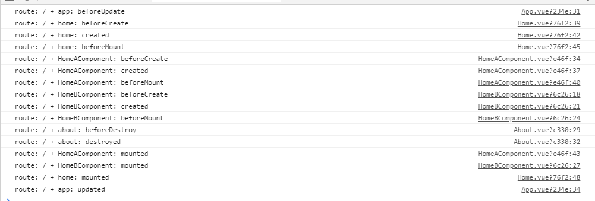

# vue-lifecycle

本项目主要目的是为了探索vue的生命周期执行顺序。

## Project setup

```
npm install
```

### Compiles and hot-reloads for development

```
npm run serve
```

### Compiles and minifies for production

```
npm run build
```

### Lints and fixes files

```
npm run lint
```

### Customize configuration

See [Configuration Reference](https://cli.vuejs.org/config/).

## 结论

### 目录

`src/mixin` 目录下放的是不同组件或者页面的混入。

| 文件 | 说明 |
| ---- | ---- |
| `allMixin.js` | 为全局混入 |
| `appAMixin.js` | `app.vue` 的 AMixin |
| `appBMixin.js` | `app.vue` 的 BMixin |
| `homeAMixin.js` | `Home.vue` 的 AMixin |
| `homeBMixin.js` | `Home.vue` 的 BMixin |
| `homeAComponentAMixin.js` | `Home.vue` 中的 `HomeAComponent.vue` 组件的 AMixin |
| `homeAComponentBMixin.js` | `Home.vue` 中的 `HomeAComponent.vue` 组件的 BMixin |
| `homeBComponentAMixin.js` | `Home.vue` 中的 `HomeBComponent.vue` 组件的 AMixin |
| `homeBComponentBMixin.js` | `Home.vue` 中的 `HomeBComponent.vue` 组件的 BMixin |

### mixin 混入说明

上面目录中提到的 mixin 文件都是 先混入 AMixin 再混入 BMixin。

例如`App.vue`：

```js
export default {
  name: 'App',
  mixins: [appAMixin, appBMixin], // 这里的顺序决定了对应文件内的生命周期执行顺序
  ...
}
```

### console 说明

#### 页面初始化时的 console


**结论：**

1. 全局混入会在之后每一个创建的 Vue 实例的时候优先执行全局混入的生命周期。

    例如：

    ```js
    allMixin: beforeCreate
    allMixin: created
    route: / + allMixin: beforeMount
    allMixin: beforeCreate
    route: / + appAMixin: beforeCreate
    route: / + appBMixin: beforeCreate
    / + app: beforeCreate
    allMixin: created
    route: / + appAMixin: created
    route: / + appBMixin: created
    route: / + app: created
    ```

2. 组件`mixins`的生命周期早于当前组件的生命周期执行：

    例如：

    ```js
    route: / + appAMixin: beforeCreate
    route: / + appBMixin: beforeCreate
    route: / + app: beforeCreate
    ```

3. 组件`mixins`配置混入的顺序决定混入的生命周期先后执行。

    例如原本输出顺序为：

    ```js
    route: / + appAMixin: beforeCreate
    route: / + appBMixin: beforeCreate
    route: / + app: beforeCreate
    ```

    修改`App.vue`中的顺序：

    ```js
    export default {
      name: 'App',
      mixins: [appBMixin, appAMixin],
      ...
    }
    ```

    输出顺序就变更为：

    ```js
    route: / + appBMixin: beforeCreate
    route: / + appAMixin: beforeCreate
    route: / + app: beforeCreate
    ```

4. 父子组件加载渲染过程时的生命周期：

    1. 父组件： `beforeCreate` -> `created` -> `beforeMount`
    2. 子组件： -> `beforeCreate` -> `created` -> `beforeMount` -> `mounted`
    3. 父组件： -> `mounted`

    这里先把全局混入及`Home.vue`中的混入去除，看起来会更清楚，例如：

    ```js
    route: / + home: beforeCreate
    route: / + home: created
    route: / + home: beforeMount
    route: / + HomeAComponent: beforeCreate
    route: / + HomeAComponent: created
    route: / + HomeAComponent: beforeMount
    route: / + HomeBComponent: beforeCreate
    route: / + HomeBComponent: created
    route: / + HomeBComponent: beforeMount
    route: / + HomeAComponent: mounted
    route: / + HomeBComponent: mounted
    route: / + home: mounted
    ```

5. 兄弟组件加载渲染过程时的生命周期：

    1. 兄组件：`beforeCreate` -> `created` -> `beforeMount`
    2. 弟组件：-> `beforeCreate` -> `created` -> `beforeMount`
    3. 兄组件：-> `mounted`
    4. 弟组件：-> `mounted`

    例如：

    ```js
    route: / + HomeAComponent: beforeCreate
    route: / + HomeAComponent: created
    route: / + HomeAComponent: beforeMount
    route: / + HomeBComponent: beforeCreate
    route: / + HomeBComponent: created
    route: / + HomeBComponent: beforeMount
    route: / + HomeAComponent: mounted
    route: / + HomeBComponent: mounted
    ```

#### 路由切换时的 console

路由切换至about时的 console:


路由切换至home时的 console:


**结论：**

1. 路由切换时会触发`App.vue`的`beforeUpdate` -> 当前路由下的组件的创建（生命周期按照父子组件及兄弟组件到最后的一个组件的`beforeMount`） -> 销毁上个路由及其组件 -> `App.vue`的`updated`。
2. 父子组件销毁过程：

    1. 父组件： `beforeDestroy`
    2. 子组件： -> `beforeDestroy` -> `destroyed`
    3. 父组件： -> `destroyed`

3. 兄弟组件销毁过程：

    1. 兄组件： `beforeDestroy` -> `destroyed`
    2. 弟组件： `beforeDestroy` -> `destroyed`

#### 组件 v-if 和 v-show 的切换

`Home.vue` 中点击 home按钮A/home按钮B 使用 v-if/v-show 切换显示隐藏 组件A/组件B。

`v-if` 组件A:


`v-show` 组件B：


**结论：**

1. `v-if` 切换隐藏组件的时候会依次触发：

    1. 父组件： `beforeUpdate`
    2. `v-if`作用的组件：展示的时候会走**初始化渲染的生命周期**，隐藏的时候会走**销毁的生命周期**
    3. 父组件： `updated`

2. `v-show` 切换隐藏组件的时候会依次触发：

    1. 父组件： `beforeUpdate`
    2. 父组件： `updated`

#### 组件内 v-if 和 v-show 的切换

`HomeAComponent.vue` 中点击 按钮1/按钮2 使用 v-if/v-show 切换显示隐藏 show content1/show content2。

`v-if` show content1：


`v-show` show content2：


**结论：**

1. 仅触发当前组件的 `beforeUpdate` -> `updated`
